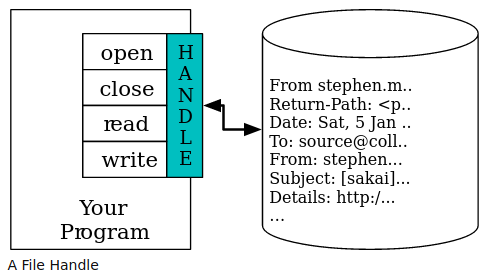

# Manejo de archivos en Python

## Recursos de interés
- Capítulo 7 del libro *Python for Everybody: Exploring data in Python 3*, de Charles Severance [PY4E - Python for Everybody - Chapter 7:Files](https://www.py4e.com/html3/07-files)

## Archivos
Los archivos proporcionan una forma de almacenar datos de manera persistente (i.e. no volátil) en medios como discos duros, discos compactos, DVD, dispositivos de almacenamiento USB y otros. Contrario a lo que sucede a las estructuras que residen en la memoria del computador, como las variables, la información almacenada en archivos permanece después de que finaliza la ejecución de un programa o se apaga el computador. En Python, los archivos se manejan como objetos de tipo [file](https://docs.python.org/3/glossary.html#term-file-object), los cuales tienen un conjunto de [métodos](https://docs.python.org/3/tutorial/inputoutput.html#reading-and-writing-files), entre las que están:

* [open()](https://docs.python.org/3/library/functions.html#open): para abrir un archivo.  
* [read()](https://docs.python.org/3/tutorial/inputoutput.html#reading-and-writing-files): para leer datos de un archivo.  
* [write()](https://docs.python.org/3/tutorial/inputoutput.html#reading-and-writing-files): para escribir datos en un archivo.  
* [close()](https://docs.python.org/3/tutorial/inputoutput.html#methods-of-file-objects): para cerrar un archivo.

Estas operaciones se ilustran en la figura 1.



Figura 1: Operaciones para manejo de archivos en Python. Imagen de Charles Severance ([https://www.py4e.com/html3/07-files](https://www.py4e.com/html3/07-files))

Estas operaciones se realizan a través de una variable llamada "manejador de archivo" (*file handle*).

## Uso de la sentencia ```with``` para leer y escribir en archivos
La sentencia [with](https://docs.python.org/3/reference/compound_stmts.html#with) se utiliza para ejecutar un bloque con métodos definidos por un [administrador de contexto (*context manager*)](https://docs.python.org/3/reference/datamodel.html#context-managers). Permite recorrer un archivo y cerrarlo automáticamente cuando se finaliza.

El siguiente bloque de código abre un archivo en modo de lectura (```"r"```) con la función open() y recorre e imprime cada una de sus líneas.
```python
# Recorrido e impresión de las líneas de un archivo de texto
with open("maravillas_antiguas.csv", "r") as archivo:
    for linea in archivo:
        print(linea, end='')
```

Para escribir en un archivo, este debe abrirse en modo de escritura (```"w"```).
```python
# Escritura en un archivo
with open("archivo_nuevo.csv", "w") as archivo:
    archivo.write('Línea 1\n')
    archivo.write('Línea 2\n')
    archivo.write('Línea 3\n')
```

## Archivos CSV
Los archivos CSV (*comma separated values*, valores separados por comas) son de los más empleados para intercambiar datos en formato tabular (i.e. en columnas). Pueden llamarse de otras formas, como por ejemplo “archivos de texto delimitado”. Son ampliamente utilizados para importar y exportar datos desde y hacia hojas electrónicas, bases de datos y otros sistemas de manejo de información. Consisten de líneas de texto en las cuales hay datos separados por comas. Cada dato corresponde a una columna. Por ejemplo, el siguiente es el contenido de un archivo CSV con cuatro columnas:

```
nombre,ubicacion,longitud,latitud
Taj Mahal,India,78.042111,27.174799
Chichen Itza,México,-88.56865,20.6829
La estatua de Cristo Redentor,Brasil,-43.210556,-22.951944
```

A pesar de ser ampliamente usados, los archivos CSV no son un formato completamente estandarizado, por lo que pueden presentarse con algunas variantes:

* La primera línea tiene usualmente los nombres de las columnas (llamados también encabezados), pero no siempre.
* El caracter separador de las columnas no siempre es una coma. Puede ser también un tabulador, un punto y coma, otro carácter o incluso una combinación de caracteres.
* Las columnas de texto pueden ir encerradas entre comillas para evitar el problema que se presenta si dentro del texto hay una coma u otro carácter separador.
* El conjunto de caracteres puede sufrir alteraciones cuando se traslada entre herramientas de software o entre sistemas operativos, sobre en todo en caracteres especiales como los acentos.

### El módulo ```csv```
El módulo [csv](https://docs.python.org/3/library/csv.html) facilita el manejo de archivos CSV en Python. Además de leer el archivo línea por línea, las separa en sus respectivas columnas, al representarlas mediante listas. El método [csv.reader()](https://docs.python.org/3/library/csv.html#csv.reader) retorna una lista con las líneas del archivo. Cada línea es, a su vez, una lista de hileras de texto que corresponden a las columnas del archivo.

```python
import csv

# Recorrido e impresión de las líneas de un archivo de texto
with open("maravillas_antiguas.csv") as archivo:
    # Se crea el objeto reader
    lector = csv.reader(archivo)
    
    # Se recorren las líneas
    for linea in lector:
        print('Línea: ', linea)
        
        # Se recorren las columnas de la línea
        for columna in linea:
            print ('Columna: ', columna)
```

El método [csv.writer()](https://docs.python.org/3/library/csv.html#csv.writer) se utiliza para escribir en un archivo CSV. El siguiente bloque de código abre un archivo CSV de entrada y recorre sus líneas. Si la columna de ubicación de una línea corresponde a Egipto o Irak, escribe la línea en un archivo de salida.

```python
import csv

with open("maravillas_antiguas.csv") as archivo_entrada:
    lector = csv.reader(archivo_entrada)

    with open("maravillas_antiguas_irak_egipto.csv", "w") as archivo_salida:
        escritor = csv.writer(archivo_salida, delimiter=',')
        i = 0
        for linea in lector:
            if i == 0:
                # Línea del encabezado
                escritor.writerow(linea)
                print(linea)
            elif linea[1] == "Irak" or linea[1] == "Egipto":
                 # La ubicación es Egipto o Irak
                escritor.writerow(linea)
                print(linea)
            i = i + 1
```
